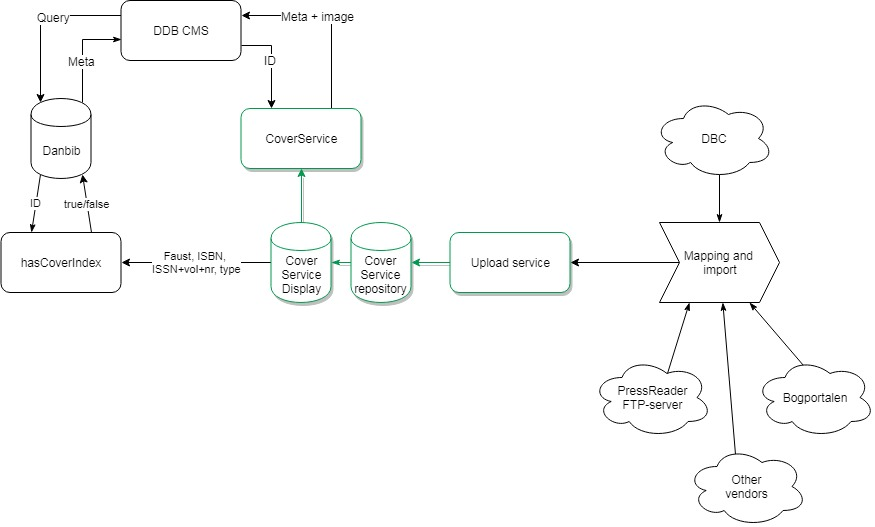

# public
Public files

<!--

## Resized

## Raw 

-->

## routeLocal2Central - Datavej klient til Danbib brønd 

## CoverServiceArchitecture - MoreInfo incl. hasCoverIndex 

<!--
[Raw jpg](https://raw.githubusercontent.com/danskernesdigitalebibliotek/public/master/CoverServiceArchitecture.2018.jpg)

-->
## CMScontent_wrapper 

<!--
[Raw jpg](https://raw.githubusercontent.com/danskernesdigitalebibliotek/public/master/CMScontent_wrapper.jpg)

-->
## DDB_infrastruktur_niveau0 
[Raw jpg](https://raw.githubusercontent.com/danskernesdigitalebibliotek/public/master/DDB_infrastruktur_niveau0.jpg)

## LibraryOrgStructure 

<!--
[Raw jpg](https://raw.githubusercontent.com/danskernesdigitalebibliotek/public/master/LibraryOrgStructure.jpg)

-->
## OpenPlatform.holdings 

<!--
[Raw jpg](https://raw.githubusercontent.com/danskernesdigitalebibliotek/public/master/LibraryOrgStructure.jpg)

-->

## OpenPlatform 

<!--

---

-->
